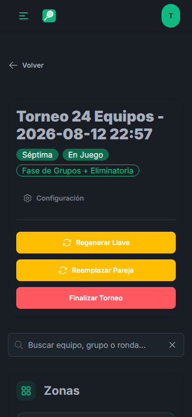
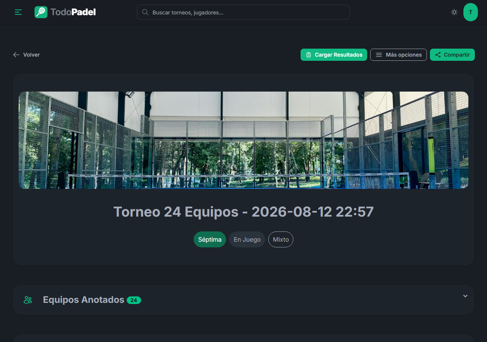
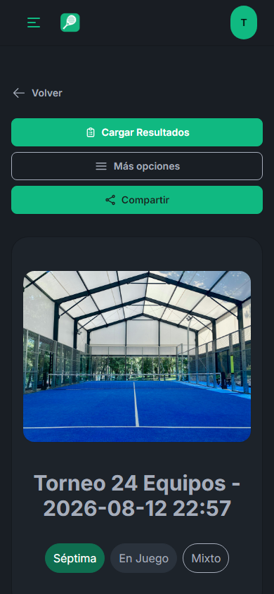
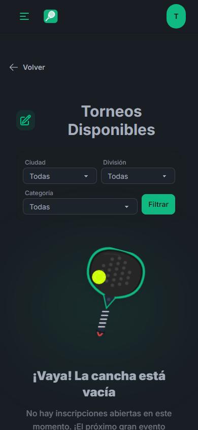
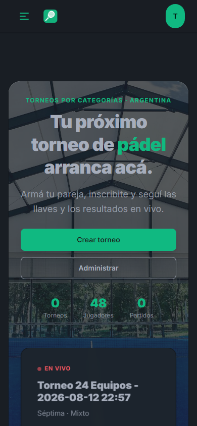
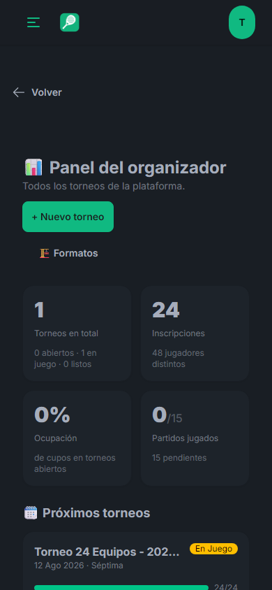

# TodoPadel — Qué se mejoró

**Agosto 2026** · Resumen de los cambios, en criollo.

---

## En una línea

Se arreglaron los problemas que frenaban a los organizadores el día del torneo,
se hizo que la app se use bien desde el celular, y se agregó el cobro de
inscripciones.

---

## 1. Cargar resultados dejó de trabarse

**El problema.** Al cargar un resultado desde el celular, la pantalla quedaba
como colgada. Había que refrescar la página para poder cargar el siguiente. En un
torneo se cargan decenas de resultados seguidos, así que era una pérdida de
tiempo constante al borde de la cancha.

**Por qué pasaba.** Cada resultado guardado obligaba a recargar la página
completa: unos 300 KB con los 24 partidos, las tablas y el cuadro. En un celular
eso son varios segundos de pantalla muerta. Si el organizador tocaba el botón
siguiente mientras tanto, no pasaba nada.

**Cómo quedó.** Ahora se actualiza únicamente la zona que tocaste: **94% menos de
datos**. El resultado se guarda, la ventana se cierra sola y podés seguir con el
siguiente al instante. Sin recargas.

---

## 2. Volvió el cuadro de la fase final

**El problema.** La llave se había convertido en pestañas separadas (Cuartos,
Semis, Final). La gente no entendía hacia qué lado del cuadro avanzaba cada
pareja.

**Cómo quedó.** Volvió el cuadro de siempre, con las ramas que conectan cada
cruce y se desplaza de lado para verlo entero.

---

## 3. Cobro de inscripciones

Ahora el torneo puede tener precio, y el jugador ve exactamente cómo pagar.

**El organizador carga una sola vez** (en Ajustes de Organización): el alias, el
titular de la cuenta y los WhatsApp a donde mandar el comprobante. Eso vale para
todos sus torneos.

**En cada torneo carga** el precio y, si quiere, una seña.

**El jugador ve**, pegado al botón de inscripción:

- Cuánto sale la seña y cuánto la inscripción completa
- El alias, con un botón para copiarlo
- El titular de la cuenta, para verificar antes de transferir
- Botones de WhatsApp con el mensaje ya escrito para mandar el comprobante
- Puede subir el comprobante desde la app

**El organizador tiene un panel de cobros** con lo recaudado, quién pagó, quién
señó, quién debe, y un botón para recordarle por WhatsApp a los que faltan.

---

## 4. Filtros para encontrar torneos

Antes la lista era una sola tira con todos los torneos del país. Un jugador de
5ta en Rosario tenía que scrollear todo.

Ahora se filtra por **ciudad, división y categoría**, y al pasar de página no se
pierden los filtros elegidos.

---

## 5. Toda la app revisada en el celular

Se revisaron las 15 pantallas principales a tamaño de celular:

| Antes | Ahora |
|---|---|
| Botones de distinto ancho, en escalera | Todos del mismo tamaño, uno debajo del otro |
| Botones que se cortaban en el borde | Ninguno se corta |
| Íconos aplastados junto a textos largos | Los íconos mantienen su forma |
| Texto encimado en la config de zonas | Cada cosa en su renglón |
| El menú "⋮" casi invisible | Botón "Más opciones" con borde y texto |
| Áreas de toque chicas para el dedo | 78 botones agrandados a 40px mínimo |

**Resultado medido: 15 de 15 pantallas sin desbordes ni botones desalineados.**

---

## 6. Gestión de parejas arreglada

Un organizador reportó tres cosas que en realidad estaban encadenadas:

1. **"Creé la pareja y no figura."** Las parejas que no encajan por división
   desaparecían del listado sin explicación. Ahora aparecen aparte, con el motivo
   escrito ("pareja de 7ma: sólo puede jugar 7ma ±1 división").
2. **"La quiero crear de nuevo y me tira error."** Daba pantalla de error. Ahora
   avisa cuál es la pareja que ya existe.
3. **"Quiero borrarla y no puedo."** El listado de parejas era solo para
   administradores. Ahora los organizadores entran, y pueden **disolver** una
   pareja mal cargada para rearmarla (sin perder el historial de torneos).

---

## 7. Panel del organizador

Una pantalla con el estado de todo: torneos activos, inscripciones, ocupación de
cupos y partidos jugados vs. pendientes.

---

## 8. Otras mejoras

- **Recordatorios automáticos**: aviso a los jugadores 24 h y 2 h antes de cada partido.
- **Placas para redes**: además de la del torneo, ahora hay de jugador y de resultado.
- **Llaves oficiales**: los cuadros siguen los formatos de la Federación Argentina de Pádel, de 6 a 48 parejas.
- **Velocidad**: la app carga más rápido (se redujo un 85% el peso de los estilos).

---

## Seguridad

- Se corrigió que un organizador pudiera, cambiando la dirección web, editar
  partidos de torneos **de otro club**.
- Se reforzó la protección contra intentos masivos de adivinar contraseñas.
- Se limitó el peso y tamaño de las imágenes que se suben.
- Se sacaron del repositorio unas copias de la base de datos que no debían estar ahí.

---

## Cómo se verificó

- **213 pruebas automáticas** que corren en cada cambio.
- Las 15 pantallas principales revisadas **a tamaño de celular real** (375 px),
  midiendo desbordes y alineación.
- Los arreglos de seguridad tienen pruebas que **fallan si el problema vuelve**.

---

*Preparado por el equipo de desarrollo de TodoPadel · todopadel.club*
